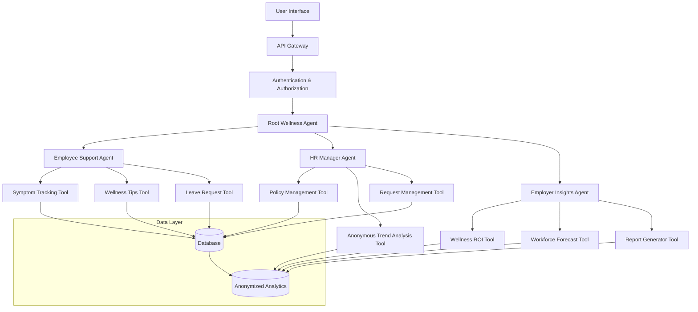
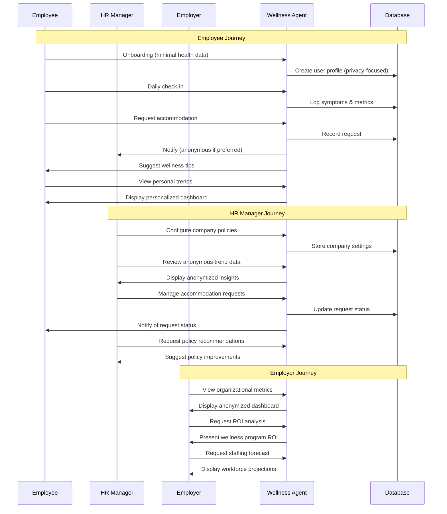
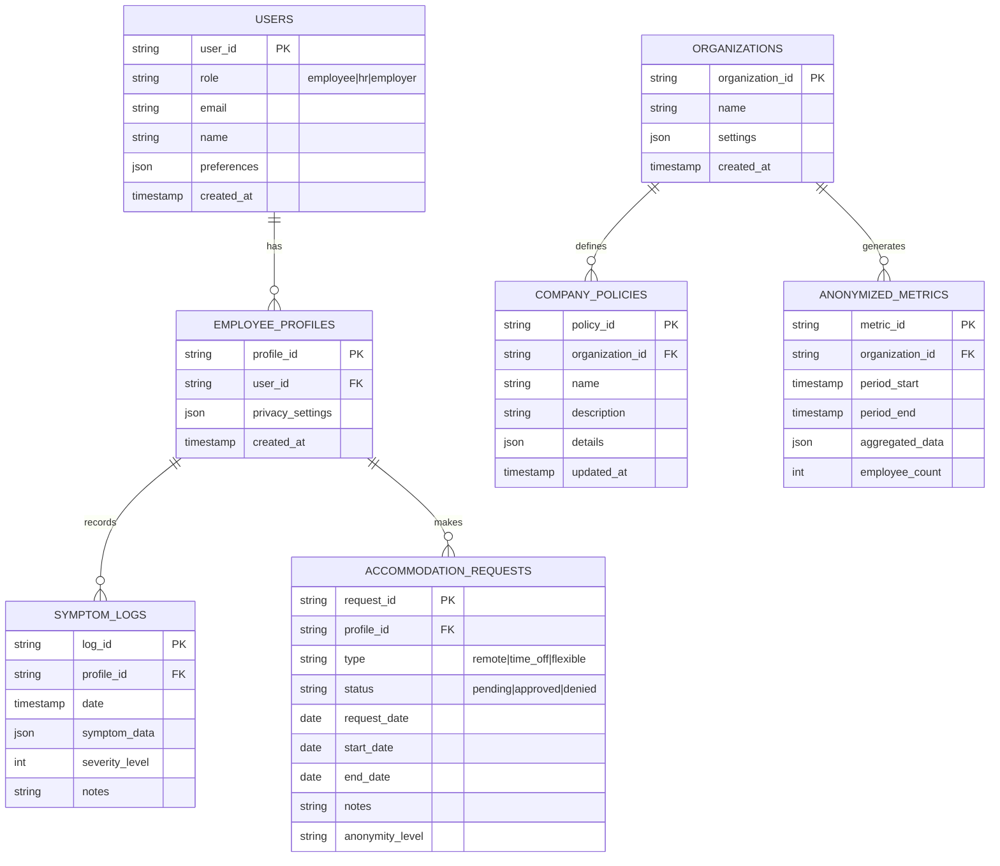
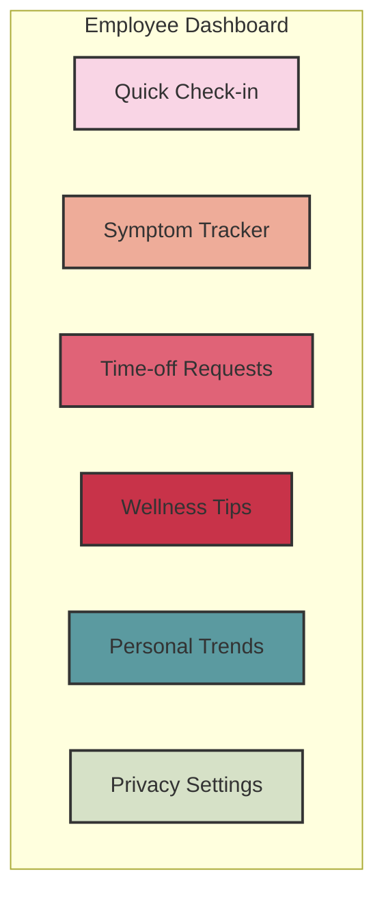
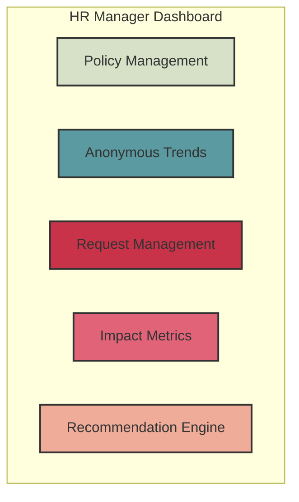
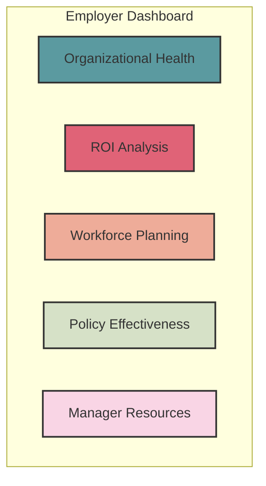
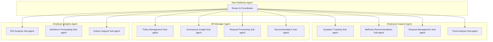
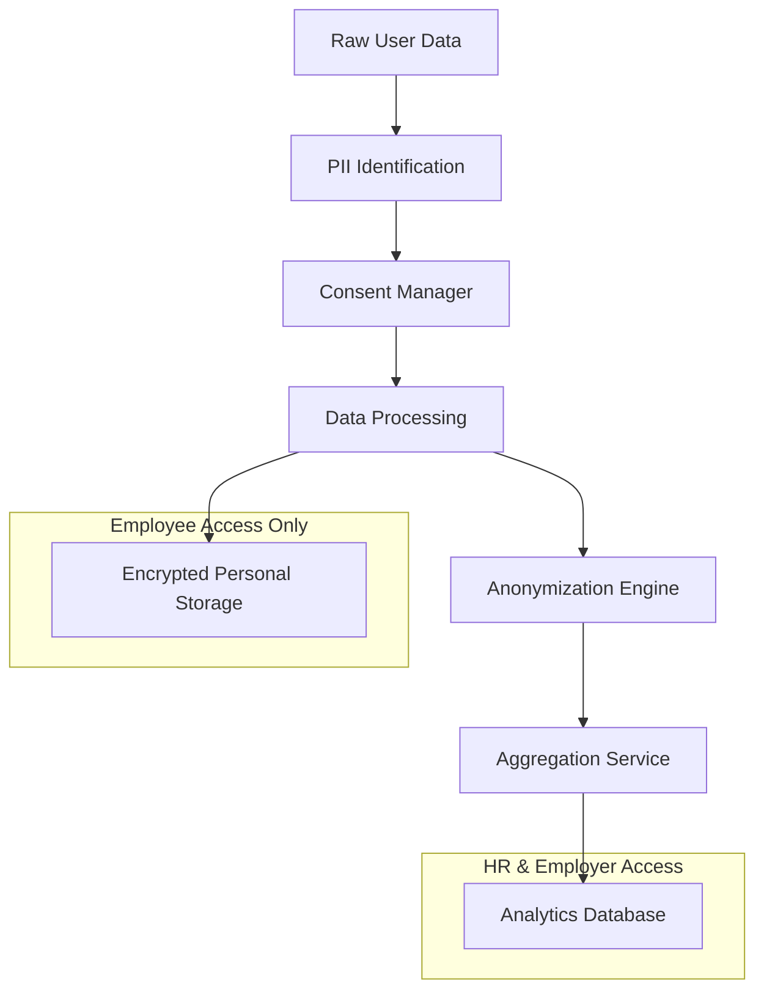

# AI Wellness Agent Design - Based on Google ADK

Based on the user stories from User-Journey.md and following Google ADK architecture patterns, here's a comprehensive design for your AI Wellness Agent that serves employees, HR managers, and employers while maintaining privacy.

## System Architecture

## User Flow

## Database Schema

## UI/UX Design

### Employee Dashboard

Key UX Principles:
- Quick emoji-based check-ins
- Non-judgmental language
- One-click accommodation requests
- Emphasis on privacy controls
- Focus on self-care and agency

### HR Manager Dashboard

Key UX Principles:
- Anonymized data visualization
- Automated request handling
- Compliance checks built-in
- Evidence-based recommendations
- Privacy-first design

### Employer Dashboard

Key UX Principles:
- Zero PII exposure
- ROI visualization
- Forecast modeling
- Culture-building resources
- Manager conversation guides

## Agent Structure

## Privacy Architecture

## Implementation Plan Using ADK

1. **Setup Environment & Install ADK**
   - Create virtual environment
   - Install google-adk
   - Set up project structure

2. **Build Core Agent Components**
   - Define root_agent and sub-agents
   - Create tools for each functionality
   - Set up callbacks for privacy protection

3. **Develop Database & Storage Layer**
   - Set up secure databases
   - Implement anonymization pipeline
   - Create memory and artifact management

4. **Create User Interfaces**
   - Implement employee dashboard
   - Develop HR manager interface
   - Build employer analytics dashboard

5. **Test & Evaluate**
   - Create evaluation datasets
   - Run local tests using `adk api_server`
   - Perform privacy audits

6. **Deploy & Monitor**
   - Deploy to Agent Engine or Cloud Run
   - Implement monitoring system
   - Set up continuous evaluation

## Tech Stack Recommendations

- **Backend**: Google ADK with Python
- **Database**: Firestore for structured data
- **Analytics**: BigQuery for anonymized analytics
- **Frontend**: React with Material UI
- **Authentication**: Firebase Auth
- **Deployment**: Google Cloud (Agent Engine or Cloud Run)
- **Privacy**: Differential privacy libraries
- **Notifications**: Firebase Cloud Messaging