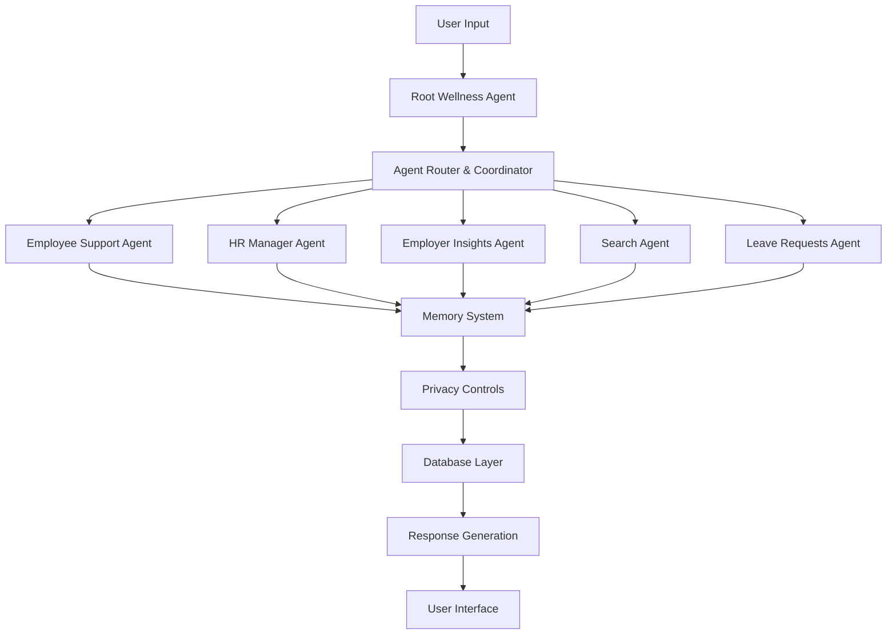
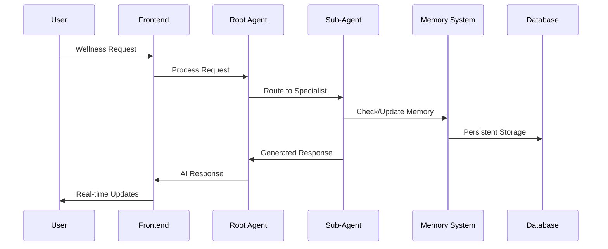
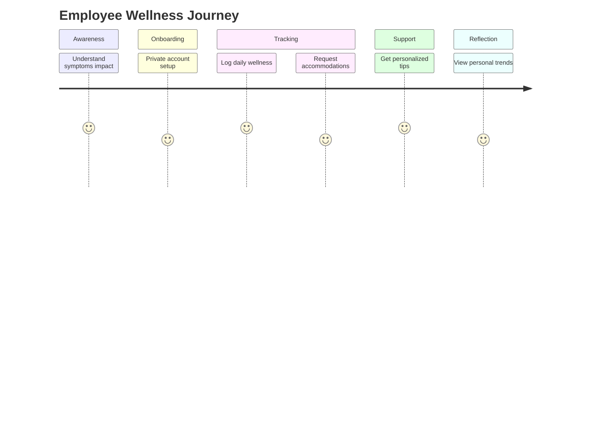
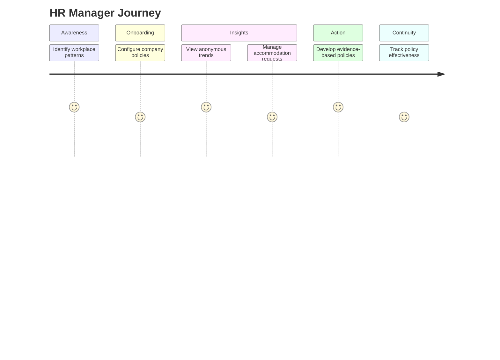
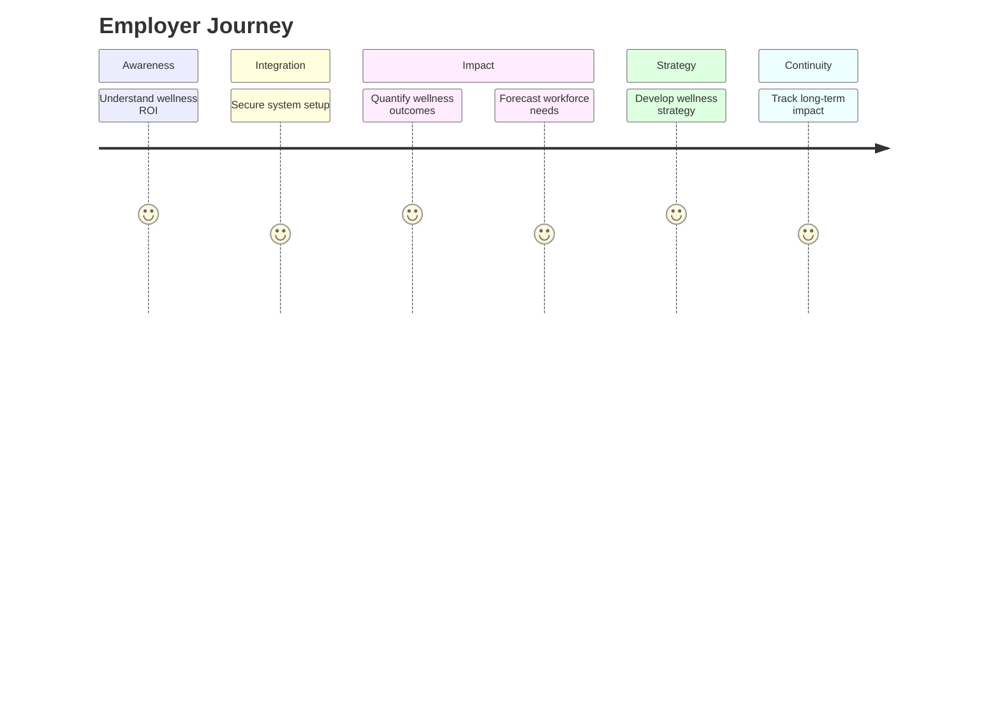
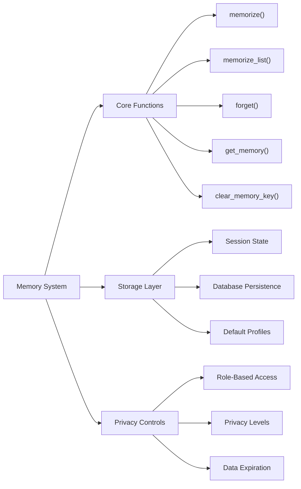
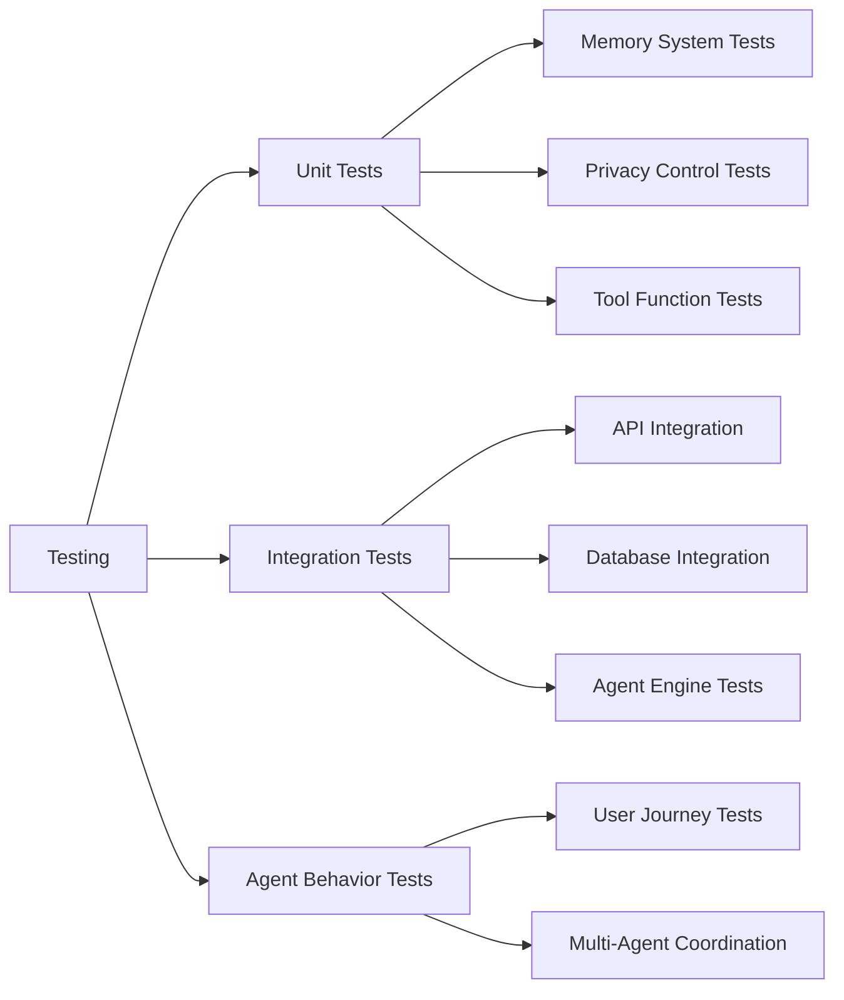

<div align="center">
 <h1>🌿 Wellness Support Agent<br/><small>AI-Powered Workplace Wellness Platform</small></h1>
 
 
 
 
 
 
 
 
</div>

> [!IMPORTANT]
> This is a comprehensive workplace wellness platform that combines Google's Agent Development Kit (ADK) with intelligent multi-agent systems. Built with Next.js frontend and Python backend, it provides privacy-focused support for employees, HR managers, and employers.

# 🌟 Introduction

A comprehensive AI-powered workplace wellness agent that leverages Google's Agent Development Kit (ADK) to provide intelligent, role-based wellness support across organizations. This full-stack application demonstrates modern multi-agent architecture with privacy-first design, real-time memory systems, and specialized agents for different organizational roles.

> [!NOTE]
> - Python >= 3.9 required
> - Node.js >= 18.0 required  
> - Google Cloud Platform account required
> - Google ADK toolkit required
> - Environment setup for Google AI services

<br/>

[](https://sanicle-wellness-agent-2lxj5uw.gamma.site/)

<br/>

## ✨ Key Features

🤖 **Multi-Agent AI System**
- 5 specialized wellness agents with distinct expertise
- Intelligent agent coordination and routing
- Privacy-focused role-based access controls
- Real-time conversational AI assistance

🏥 **Comprehensive Wellness Support**
- Employee symptom tracking and accommodation requests
- HR manager anonymous trend analysis and policy creation
- Employer ROI calculation and workforce insights
- Privacy-first design with data protection

🧠 **Advanced Memory System**
- Persistent conversation memory across sessions
- Personalized user experience with preference retention
- Role-based memory access and data segregation
- Default profile loading for new users

🔒 **Enterprise Privacy Controls**
- Role-based data access restrictions
- Anonymous aggregation for organizational insights
- GDPR-compliant data handling
- Custom privacy callbacks and validation

## 📚 Table of Contents

- [🌟 Introduction](#-introduction)
  - [✨ Key Features](#-key-features)
  - [📚 Table of Contents](#-table-of-contents)
  - [🛠️ Tech Stack](#️-tech-stack)
  - [🏗️ Architecture Overview](#️-architecture-overview)
    - [Multi-Agent System Architecture](#multi-agent-system-architecture)
    - [Frontend Architecture](#frontend-architecture)
    - [Backend Architecture](#backend-architecture)
    - [Data Flow Architecture](#data-flow-architecture)
  - [🎯 User Journey Workflows](#-user-journey-workflows)
    - [For Employees](#for-employees)
    - [For HR Managers](#for-hr-managers)
    - [For Employers](#for-employers)
  - [📂 Project Structure](#-project-structure)
  - [🚀 Getting Started](#-getting-started)
    - [Prerequisites](#prerequisites)
    - [Quick Start Installation](#quick-start-installation)
    - [Environment Configuration](#environment-configuration)
    - [Database Setup](#database-setup)
  - [🤖 AI Agent System](#-ai-agent-system)
    - [Available Agents](#available-agents)
    - [Agent Capabilities](#agent-capabilities)
  - [💾 Memory System](#-memory-system)
  - [📖 Development Guide](#-development-guide)
    - [Adding New Agent Modules](#adding-new-agent-modules)
    - [Creating Custom Privacy Controls](#creating-custom-privacy-controls)
    - [Performance Optimization](#performance-optimization)
  - [🧪 Testing](#-testing)
  - [🚀 Deployment](#-deployment)
    - [Google Cloud Deployment](#google-cloud-deployment)
    - [Frontend Deployment](#frontend-deployment)
    - [Environment Variables](#environment-variables)
  - [🧪 Testing](#-testing-1)
  - [🤝 Contributing](#-contributing)
  - [📄 License](#-license)
  - [🙋‍♀️ Author](#️-author)

## 🛠️ Tech Stack

<div align="center">
  <table>
    <tr>
      <td align="center" width="96">
        
        <br>Next.js 15
      </td>
      <td align="center" width="96">
        
        <br>React 19
      </td>
      <td align="center" width="96">
        
        <br>TypeScript
      </td>
      <td align="center" width="96">
        
        <br>Python 3.9+
      </td>
      <td align="center" width="96">
        
        <br>Google ADK
      </td>
      <td align="center" width="96">
        
        <br>FastAPI
      </td>
      <td align="center" width="96">
        
        <br>Google Cloud
      </td>
    </tr>
  </table>
</div>

> [!TIP]
> Each technology was carefully selected for enterprise-ready deployment, scalability, and Google Cloud integration. The multi-agent architecture allows for specialized AI assistance across different organizational roles while maintaining strict privacy controls.

## 🏗️ Architecture Overview

### Multi-Agent System Architecture

The platform employs a sophisticated multi-agent architecture built on Google's Agent Development Kit (ADK):



### Frontend Architecture

Built with modern React patterns and Google Cloud integration:

- **Component Architecture**: Modular, reusable components with TypeScript
- **State Management**: Custom hooks with persistent memory integration
- **Real-time Updates**: Agent-powered live interactions
- **Performance**: Optimized rendering and memory caching
- **Accessibility**: WCAG 2.1 compliant with screen reader support

### Backend Architecture

Python-based agent system with Google ADK orchestration:

| Component | Purpose | Technology |
|-----------|---------|------------|
| Root Agent | Coordinates requests between specialized agents | Google ADK |
| Sub-Agents | Domain-specific wellness assistance | Gemini 1.5 Flash |
| Memory System | Persistent conversation and preference storage | Custom Implementation |
| Privacy Layer | Role-based access controls and data protection | Custom Callbacks |
| API Gateway | RESTful API with FastAPI | FastAPI + Uvicorn |

### Data Flow Architecture



## 🎯 User Journey Workflows

### For Employees



**Employee Experience:**
- **Symptom Continuity**: Track personal wellness patterns over time
- **Preference Retention**: Have communication style and accommodations remembered
- **Personalized Experience**: Receive increasingly tailored wellness tips
- **Privacy Control**: Maintain full control over personal health information

### For HR Managers



**HR Manager Experience:**
- **Organizational Context**: Maintain continuity in policy decisions
- **Pattern Recognition**: Identify anonymous wellness trends
- **Accommodation Consistency**: Handle similar requests fairly
- **Policy Evolution**: Track policy effectiveness over time

### For Employers



**Employer Experience:**
- **Strategic Memory**: Track ROI and impacts over time
- **Benchmarking**: Compare effectiveness of different programs
- **Reporting Continuity**: Maintain consistent metrics
- **Cultural Progress**: Monitor improvements in workplace wellness

## 📂 Project Structure

```
wellness-agent/
├── frontend/                     # Next.js frontend application
│   ├── app/
│   │   ├── (auth)/              # Authentication routes
│   │   ├── (chat)/              # Chat interface
│   │   └── api/                 # API routes
│   ├── components/              # Reusable UI components
│   │   ├── ui/                  # Base UI components
│   │   ├── chat.tsx             # Chat interface
│   │   ├── sidebar.tsx          # Navigation sidebar
│   │   └── auth-form.tsx        # Authentication forms
│   ├── hooks/                   # Custom React hooks
│   └── lib/                     # Utility libraries
├── wellness_agent/              # Backend AI agent system
│   ├── sub_agents/              # Specialized agent modules
│   │   ├── employee_support/    # Employee wellness agent
│   │   ├── hr_manager/          # HR management agent
│   │   ├── employer_insights/   # Employer analytics agent
│   │   ├── search/              # Web search agent
│   │   └── leave_requests/      # Leave request agent
│   ├── services/                # Business logic services
│   │   ├── db/                  # Database services
│   │   ├── analytics_service.py # Analytics processing
│   │   └── service_factory.py   # Service orchestration
│   ├── shared_libraries/        # Common utilities
│   │   ├── memory.py            # Memory management system
│   │   └── emoji_inputs.py      # UI helper utilities
│   ├── privacy/                 # Privacy control system
│   │   ├── anonymizer.py        # Data anonymization
│   │   └── callbacks.py         # Privacy validation
│   ├── db/                      # Database models and schemas
│   │   ├── models/              # Data models
│   │   └── default_profiles/    # Default user profiles
│   ├── tools/                   # Agent tools and handlers
│   ├── agent.py                 # Main agent coordinator
│   ├── server.py                # FastAPI server
│   └── prompts.py               # Agent instructions
├── deployment/                  # Deployment scripts
│   ├── deploy.py                # Google Cloud deployment
│   └── test_deployment.py       # Deployment testing
├── eval/                        # Evaluation framework
├── tests/                       # Test suites
├── mock_db/                     # Mock data for development
└── requirements.txt             # Python dependencies
```

## 🚀 Getting Started

### Prerequisites

> [!IMPORTANT]
> Ensure you have the following installed:
> - Python 3.9 or higher
> - Node.js 18.0 or higher
> - npm or yarn package manager
> - Git version control
> - Google Cloud Platform account
> - Google ADK toolkit
> - Environment access to Google AI services

### Quick Start Installation

**1. Clone and Setup Backend:**

```bash
# Clone the repository
git clone https://github.com/ChanMeng666/wellness-agent.git
cd wellness-agent

# Create virtual environment
python -m venv .venv

# Activate virtual environment
# Windows:
.venv\Scripts\activate
# macOS/Linux:
source .venv/bin/activate

# Install Python dependencies
pip install -r requirements.txt
```

**2. Setup Frontend:**

```bash
# Navigate to frontend directory
cd frontend

# Install frontend dependencies
npm install
```

**3. Initialize Mock Database:**

```bash
# Return to root directory
cd ..

# Setup mock data for development
python setup_mock_data.py
```

### Environment Configuration

**Root Environment (.env):**

```bash
# Google AI Configuration
GOOGLE_API_KEY=your_google_api_key_here
GOOGLE_CLOUD_PROJECT=your_gcp_project_id
GOOGLE_CLOUD_LOCATION=us-central1
GOOGLE_CLOUD_STORAGE_BUCKET=your_storage_bucket

# Development Configuration
USE_MOCK_SERVICES=true
LOG_LEVEL=INFO

# Demo User Configuration
DEMO_PROFILE_ID=demo_profile_123
DEMO_ORGANIZATION_ID=demo_org_456
```

**Frontend Environment (frontend/.env.local):**

```bash
# Backend API Configuration
NEXT_PUBLIC_BACKEND_URL=http://localhost:8000

# Authentication Configuration
NEXTAUTH_SECRET=your_nextauth_secret_here
NEXTAUTH_URL=http://localhost:3000

# Database Configuration (if using persistent storage)
POSTGRES_URL=your_postgres_connection_string
```

### Database Setup

**For Development (Mock Database):**

The project includes a comprehensive mock database system that simulates real enterprise data:

```bash
# Initialize mock data
python setup_mock_data.py

# This creates:
# - Sample employee profiles
# - Mock accommodation requests
# - Wellness program data
# - Anonymized trend data
```

**For Production (Google Cloud):**

```bash
# Setup Google Cloud services
gcloud auth application-default login
gcloud config set project YOUR_PROJECT_ID

# Initialize Firestore database
# (This will be handled automatically by the deployment script)
```

**4. Start the Application:**

**Terminal 1 - Backend:**
```bash
# Activate virtual environment
.venv\Scripts\activate  # Windows
# source .venv/bin/activate  # macOS/Linux

# Start the ADK development server
adk web
# Or start the FastAPI server directly
python run_dev_server.py
```

**Terminal 2 - Frontend:**
```bash
cd frontend
npm run dev
```

**5. Access the Application:**

- **Frontend**: http://localhost:3000
- **Backend API**: http://localhost:8000
- **ADK Web Interface**: http://localhost:8080
- **API Documentation**: http://localhost:8000/docs

## 🤖 AI Agent System

### Available Agents

The platform features 5 specialized AI agents built on Google's Agent Development Kit:

| Agent | Purpose | Capabilities | Privacy Level |
|-------|---------|-------------|---------------|
| **Employee Support** | Personal wellness assistance | Symptom tracking, wellness tips, accommodation requests | Fully Private |
| **HR Manager** | Anonymous trend analysis | Department metrics, policy creation, request management | Anonymized Data |
| **Employer Insights** | Organizational analytics | ROI calculation, workforce planning, culture insights | Aggregated Data |
| **Search Agent** | Web-based wellness information | Evidence-based research, policy templates, best practices | Public Data |
| **Leave Requests** | Accommodation processing | Request handling, plan creation, privacy-first processing | Role-Based Access |

### Agent Capabilities

**🗣️ Natural Language Processing:**
- Conversational wellness queries with context awareness
- Multi-turn dialogue support with memory persistence
- Intent recognition across different organizational roles
- Empathetic response generation for sensitive topics

**📊 Data Integration:**
- Real-time database operations with privacy controls
- Cross-agent data correlation and insights
- Intelligent data validation and sanitization
- Automated trend analysis and reporting

**🎯 Role-Based Personalization:**
- Individual user profile adaptation and learning
- Organization-specific policy and culture integration
- Learning from interaction patterns and feedback
- Adaptive response optimization by user role

## 💾 Memory System

The platform implements a sophisticated memory system that enhances user experience while preserving privacy:



**Memory Functions:**
- `memorize(key, value)`: Store single key-value pairs for user preferences
- `memorize_list(key, value)`: Append to lists for tracking multiple items
- `forget(key, value)`: Remove specific information while preserving context
- `get_memory(key)`: Retrieve stored information with privacy validation
- `clear_memory_key(key)`: Erase entire categories of information

**Privacy Architecture:**
- **Employee Memory**: Personal health data, preferences, accommodation history
- **HR Memory**: Policy decisions, department patterns, process improvements
- **Employer Memory**: Business metrics, ROI data, strategic initiatives
- **Cross-Role Protection**: Strict data segregation between user types

## 📖 Development Guide

### Adding New Agent Modules

**1. Create Agent Structure:**

```bash
# Create new agent directory
mkdir wellness_agent/sub_agents/new_agent

# Create agent files
touch wellness_agent/sub_agents/new_agent/__init__.py
touch wellness_agent/sub_agents/new_agent/agent.py
```

**2. Implement Agent Logic:**

```python
# wellness_agent/sub_agents/new_agent/agent.py
from google.adk.agents import Agent
from google.adk.tools.agent_tool import AgentTool
from wellness_agent.shared_libraries.memory import memorize, get_memory
from google.adk.tools import FunctionTool

# Create memory tools
memory_tools = [
    FunctionTool(func=memorize),
    FunctionTool(func=get_memory)
]

# Create specialized agent
new_agent = Agent(
    name="new_wellness_agent",
    description="Agent for specialized wellness functionality",
    model="gemini-1.5-flash",
    instruction="""Your agent instruction here...""",
    tools=memory_tools
)

# Create agent tool
new_agent_tool = AgentTool(agent=new_agent)
```

**3. Register Agent:**

```python
# Add to wellness_agent/agent.py
from wellness_agent.sub_agents.new_agent.agent import new_agent_tool

# Add to root agent tools list
root_agent = Agent(
    # ... existing configuration
    tools=[
        # ... existing tools
        new_agent_tool
    ]
)
```

### Creating Custom Privacy Controls

**Privacy Callback Template:**

```python
from typing import Dict, Any

def custom_privacy_callback(state: Dict[str, Any]) -> Dict[str, Any]:
    """
    Custom privacy control implementation.
    """
    user_role = state.get("user_role", "unknown")
    
    # Implement role-based filtering
    if user_role == "employee":
        # Full access to personal data
        return state
    elif user_role == "hr_manager":
        # Filter individual health data
        return filter_individual_data(state)
    elif user_role == "employer":
        # Only aggregated organizational data
        return filter_to_aggregated_data(state)
    
    return state

def filter_individual_data(state: Dict[str, Any]) -> Dict[str, Any]:
    """Remove individual employee health information"""
    filtered_state = state.copy()
    sensitive_keys = ['employee_symptoms', 'personal_health_data']
    for key in sensitive_keys:
        filtered_state.pop(key, None)
    return filtered_state
```

### Performance Optimization

**Memory Caching Strategy:**

```python
# Implement intelligent caching
class MemoryCache:
    def __init__(self):
        self.cache = {}
        self.ttl = {
            'user_preferences': 86400,    # 24 hours
            'wellness_tips': 3600,        # 1 hour
            'trend_data': 1800,           # 30 minutes
            'policy_documents': 7200      # 2 hours
        }
    
    def get_with_cache(self, key: str, data_type: str):
        # Implement cache-first data retrieval
        if key in self.cache and not self.is_expired(key, data_type):
            return self.cache[key]
        
        # Fetch fresh data and cache
        fresh_data = self.fetch_from_database(key)
        self.cache[key] = fresh_data
        return fresh_data
```

## 🧪 Testing

**Testing Framework:**

Run the comprehensive test suite:

```bash
# Backend tests
pytest tests/

# Test specific agent functionality  
python -m pytest tests/test_agents.py

# Test deployment
cd deployment
python test_deployment.py --resource_id YOUR_DEPLOYED_AGENT_ID --user_id test_user
```

**Frontend Testing:**

```bash
cd frontend
npm test
npm run test:e2e
```

**Test Coverage Areas:**
- ✅ Agent initialization and tool configuration
- ✅ Memory system persistence and retrieval
- ✅ Privacy controls and role-based access
- ✅ Multi-agent coordination and routing
- ✅ API integration and responses
- ✅ End-to-end user journey validation

## 🚀 Deployment

### Google Cloud Deployment

**Using ADK Deployment Tools:**

```bash
# Authenticate with Google Cloud
gcloud auth application-default login
gcloud config set project YOUR_PROJECT_ID

# Deploy agent to Google Cloud
cd deployment
python deploy.py --create --project_id YOUR_PROJECT_ID --location us-central1
```

**Agent Engine Configuration:**

```python
# deployment/deploy.py configuration
remote_agent = agent_engines.create(
    adk_app,
    display_name="Wellness Support Agent",
    requirements=[
        "google-adk (>=0.0.2)",
        "google-cloud-aiplatform[agent_engines] (>=1.91.0)",
        "google-genai (>=1.5.0)",
        "pydantic (>=2.10.6)",
        "python-dotenv (>=1.0.0)"
    ]
)
```

### Frontend Deployment

**Vercel Deployment:**

```bash
# Frontend deployment
cd frontend
npm run build
vercel --prod
```

**Docker Deployment:**

```dockerfile
# Dockerfile for backend
FROM python:3.9-slim
WORKDIR /app
COPY . .
RUN pip install -r requirements.txt
CMD ["python", "run_dev_server.py"]
```

### Environment Variables

**Production Environment Variables:**

| Variable | Purpose | Required |
|----------|---------|----------|
| `GOOGLE_API_KEY` | Google AI services access | ✅ |
| `GOOGLE_CLOUD_PROJECT` | GCP project identifier | ✅ |
| `GOOGLE_CLOUD_LOCATION` | GCP deployment region | ✅ |
| `GOOGLE_CLOUD_STORAGE_BUCKET` | File storage bucket | ✅ |
| `USE_MOCK_SERVICES` | Development mode toggle | 🔶 |
| `LOG_LEVEL` | Application logging level | 🔶 |

## 🧪 Testing



**Testing Framework:**

Run the comprehensive test suite:

```bash
# Backend tests
pytest tests/

# Test specific agent functionality
python -m pytest tests/test_agents.py

# Test deployment
cd deployment
python test_deployment.py --resource_id YOUR_DEPLOYED_AGENT_ID --user_id test_user
```

**Frontend Testing:**

```bash
cd frontend
npm test
npm run test:e2e
```

**Evaluation Framework:**

```bash
# Run agent evaluation
cd eval
python test_eval.py
```

**Test Coverage Areas:**
- ✅ **Agent Initialization**: All 5 agents properly initialize with correct tools
- ✅ **Memory System**: Persistent storage and retrieval across sessions
- ✅ **Privacy Controls**: Role-based data access and filtering
- ✅ **Multi-Agent Routing**: Proper request routing to specialized agents
- ✅ **API Integration**: RESTful API endpoints and responses
- ✅ **User Journeys**: End-to-end workflow validation

## 🤝 Contributing

We welcome contributions to the Wellness Support Agent! Here's how you can help:

**Development Process:**

1. **Fork and Clone:**
```bash
git clone https://github.com/ChanMeng666/wellness-agent.git
cd wellness-agent
```

2. **Create Feature Branch:**
```bash
git checkout -b feature/amazing-wellness-feature
```

3. **Development Setup:**
```bash
# Backend setup
python -m venv .venv
source .venv/bin/activate  # or .venv\Scripts\activate on Windows
pip install -r requirements.txt

# Frontend setup
cd frontend
npm install
npm run dev
```

4. **Code Guidelines:**
- ✅ Follow Google ADK best practices
- ✅ Implement comprehensive privacy controls
- ✅ Add unit tests for new agent functionality
- ✅ Follow accessibility guidelines (WCAG 2.1)
- ✅ Add proper error handling and validation
- ✅ Document agent instructions and capabilities

5. **Submit Pull Request:**
- Provide clear description of wellness functionality changes
- Include test cases for new agent behaviors
- Reference related issues or feature requests
- Ensure all privacy controls are properly implemented

**Issue Reporting:**
- 🐛 Bug reports with agent behavior details
- 💡 Feature requests for new wellness capabilities
- 📚 Documentation improvements
- 🔒 Privacy and security enhancements

## 📄 License

This project is licensed under the Apache 2.0 License - see the [LICENSE](LICENSE) file for details.

## 🙋‍♀️ Author

**Chan Meng** - Senior AI/ML Infrastructure Engineer
-  LinkedIn: [chanmeng666](https://www.linkedin.com/in/chanmeng666/)
-  GitHub: [ChanMeng666](https://github.com/ChanMeng666)
-  Email: chanmeng.dev@gmail.com

---

<div align="center">
<strong>🌿 Empowering Workplace Wellness Through AI 💼</strong>
<br/>
<em>Privacy-first AI agents for organizational health and wellbeing</em>
<br/><br/>
⭐ Star us on GitHub | 📖 Read the Docs | 🐛 Report Issues | 💡 Request Features
<br/><br/>


</div>
