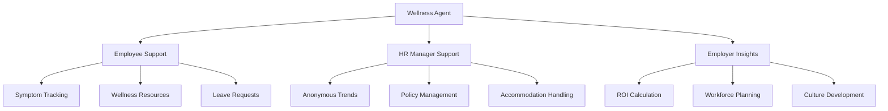
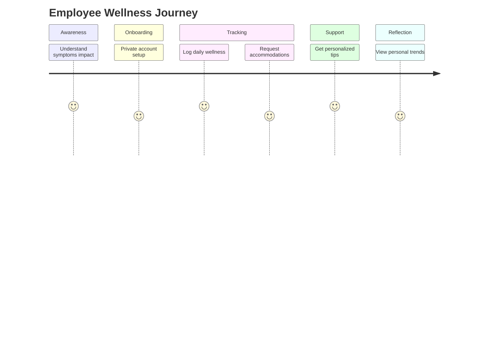
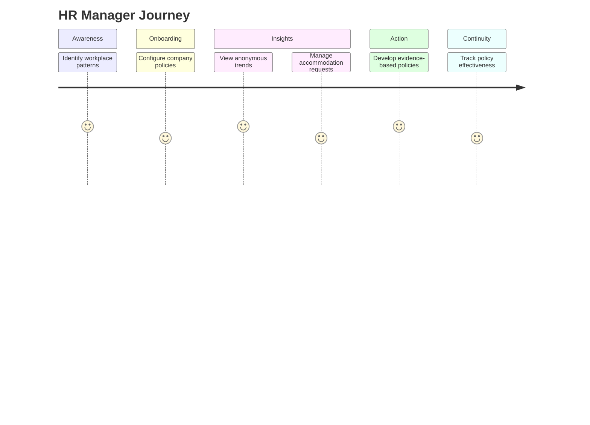
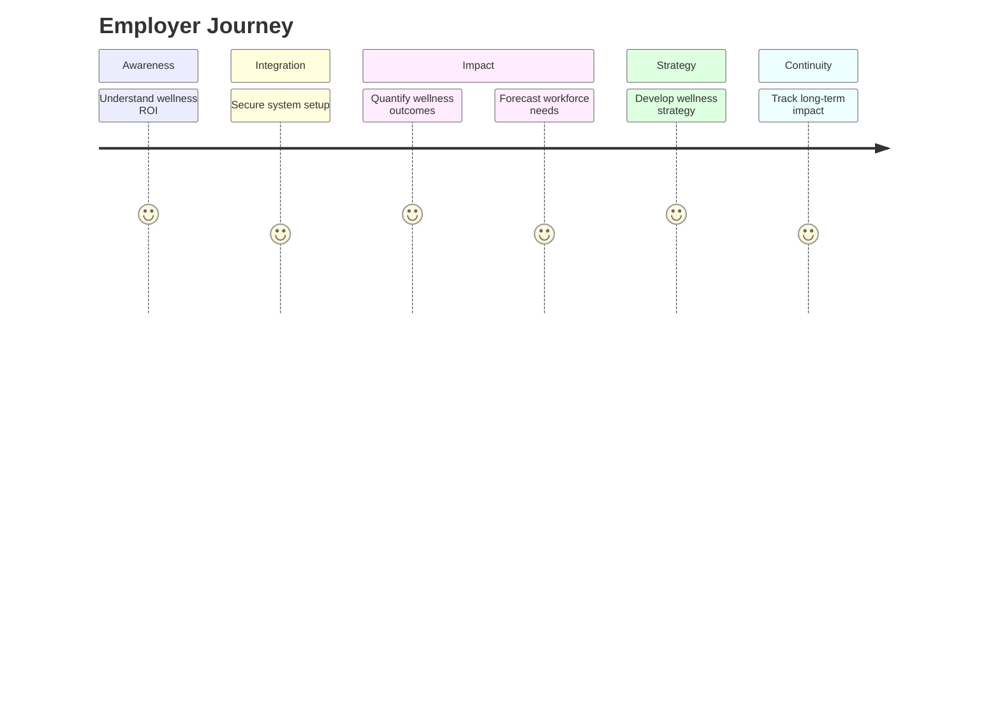
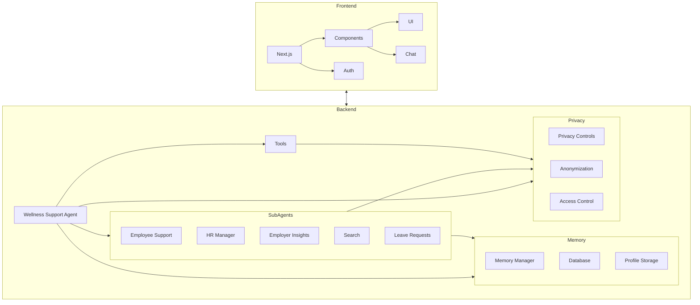
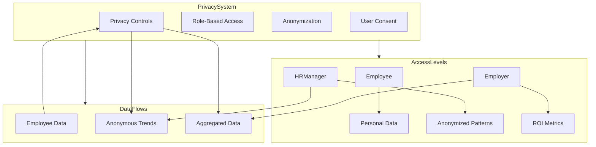
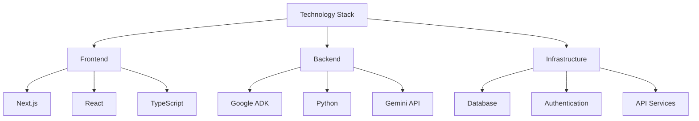
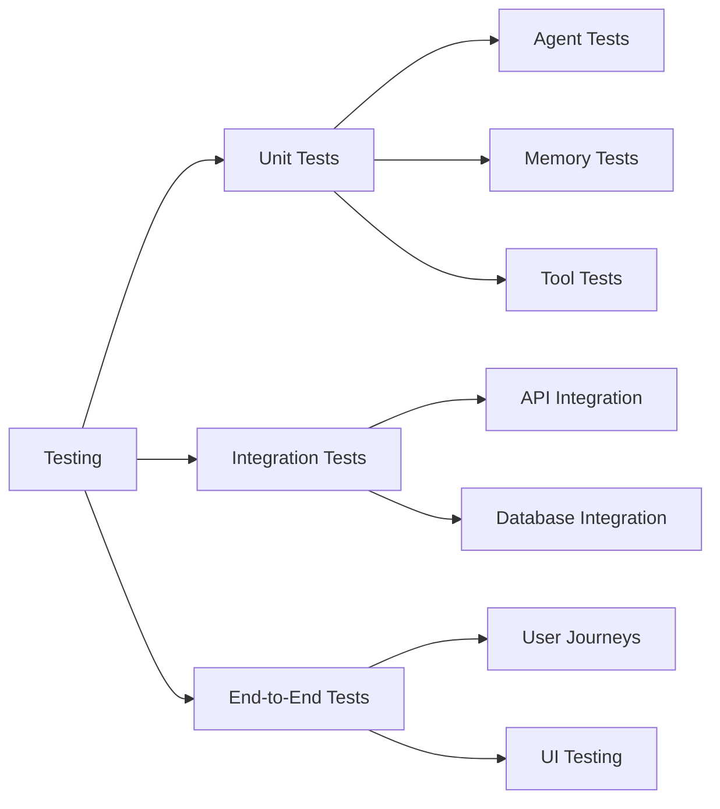

# Wellness Support Agent

A comprehensive workplace wellness agent built with Google's Agent Development Kit (ADK) that supports employees, HR managers, and employers with privacy-focused tools.



## Project Overview

This agent aims to create a more supportive, inclusive workplace by helping:
- **Employees** track symptoms, get wellness tips, and request accommodations
- **HR Managers** analyze anonymous trends, manage accommodations, and develop policies  
- **Employers** calculate ROI, forecast workforce impacts, and improve culture

All while maintaining strict privacy controls and data protections.

## Key User Journeys

### For Employees



- **Symptom Continuity**: Track personal wellness patterns over time
- **Preference Retention**: Have communication style and accommodations remembered
- **Personalized Experience**: Receive increasingly tailored wellness tips
- **Privacy Control**: Maintain full control over personal health information

### For HR Managers



- **Organizational Context**: Maintain continuity in policy decisions
- **Pattern Recognition**: Identify anonymous wellness trends
- **Accommodation Consistency**: Handle similar requests fairly
- **Policy Evolution**: Track policy effectiveness over time

### For Employers



- **Strategic Memory**: Track ROI and impacts over time
- **Benchmarking**: Compare effectiveness of different programs
- **Reporting Continuity**: Maintain consistent metrics
- **Cultural Progress**: Monitor improvements in workplace wellness

## Features

### For Employees
- Quick, judgment-free symptom tracking
- Workplace-appropriate wellness tips
- Privacy-controlled accommodation requests
- Personal health trend insights
- Personalized experiences through persistent memory

### For HR Managers
- Anonymous wellness trend analysis
- Streamlined accommodation management
- Evidence-based policy suggestions
- Privacy-compliant reporting tools
- Organizational memory for policy continuity

### For Employers
- Wellness ROI calculation
- Workforce impact forecasting
- Culture improvement resources
- Anonymous organizational insights
- Long-term trend memory for strategic planning

## Architecture



The Wellness Agent uses a hierarchical multi-agent system with:
- A root coordinator agent
- Specialized sub-agents for different user roles
- Custom privacy callbacks
- Role-based tool access
- Memory integration across all sub-agents

## Memory System

The agent includes a robust memory system that enhances user experience while preserving privacy:

```mermaid
graph LR
    A[Memory System] --> B[User Functions]
    A --> C[Storage]
    A --> D[Privacy Controls]
    
    B --> B1[memorize()]
    B --> B2[memorize_list()]
    B --> B3[forget()]
    B --> B4[get_memory()]
    B --> B5[clear_memory_key()]
    
    C --> C1[Session State]
    C --> C2[Database]
    C --> C3[Default Profiles]
    
    D --> D1[Role-Based Access]
    D --> D2[Privacy Levels]
    D --> D3[User Consent]
```

Memory functions include:
- `memorize()`: Store single key-value pairs
- `memorize_list()`: Append to a list of values under a key
- `forget()`: Remove specific information
- `get_memory()`: Retrieve stored information by key
- `clear_memory_key()`: Erase an entire category of information

The memory architecture is implemented with:
- `shared_libraries/memory.py`: Core memory functions and utilities
- Database integration for persistent storage
- Privacy-aware memory access controls
- Session state management for conversation continuity
- Default profile loading for new users

## Privacy Focus



This agent was built with privacy at its core:
- Symptom data is private by default
- Anonymized aggregation for organizational insights
- Role-based access controls
- Minimum group sizes for trend reports
- User control over data sharing preferences
- Memory system respects privacy settings

## Technology Stack



- **Frontend**: Next.js, React, TypeScript
- **Backend**: Google Agent Development Kit, Python
- **AI Model**: Gemini 1.5 Flash
- **Database**: Configurable (mock DB for development)
- **Memory System**: Custom implementation with database integration
- **Privacy Controls**: Custom callbacks and role-based access

## Installation

1. Clone this repository
2. Create a virtual environment: `python -m venv .venv`
3. Activate the environment:
   - Windows: `.venv\Scripts\activate`
   - Mac/Linux: `source .venv/bin/activate`
4. Install dependencies: `pip install -r requirements.txt`
5. Create a `.env` file with your API keys (see `.env.example`)

## Running the Application

### Backend Development Server

```python
python run_dev_server.py
```

Run the development UI:
```bash
cd wellness-agent
adk web
```

Or run the CLI interface:
```bash
cd wellness-agent
adk run wellness_agent
```

### Frontend Development

```bash
cd frontend
npm install
npm run dev
```

## Project Structure

```mermaid
graph TD
    Root[wellness-agent/] --> Backend[wellness_agent/]
    Root --> Frontend[frontend/]
    Root --> Tests[tests/]
    Root --> MockDB[mock_db/]
    Root --> Deploy[deployment/]
    Root --> Eval[eval/]
    Root --> Docs[Documentation]
    
    Backend --> SubAgents[sub_agents/]
    Backend --> Services[services/]
    Backend --> Tools[tools/]
    Backend --> DB[db/]
    Backend --> Privacy[privacy/]
    Backend --> Libraries[shared_libraries/]
    
    SubAgents --> Employee[employee_support/]
    SubAgents --> HR[hr_manager/]
    SubAgents --> Employer[employer_insights/]
    SubAgents --> Search[search/]
    SubAgents --> Leave[leave_requests/]
    
    Frontend --> App[app/]
    Frontend --> Components[components/]
    Frontend --> Lib[lib/]
    Frontend --> Hooks[hooks/]
    Frontend --> PublicDir[public/]
    
    App --> Auth[(auth)/]
    App --> Chat[(chat)/]
    App --> API[api/]
```

## Development

To contribute:
1. Fork the repository
2. Create your feature branch
3. Add tests for new functionality
4. Ensure all tests pass
5. Submit a pull request

## Testing



Run the test suite with:
```bash
pytest
```

For frontend tests:
```bash
cd frontend
npm test
```

## License

This project is licensed under the Apache 2.0 License - see the LICENSE file for details. 
